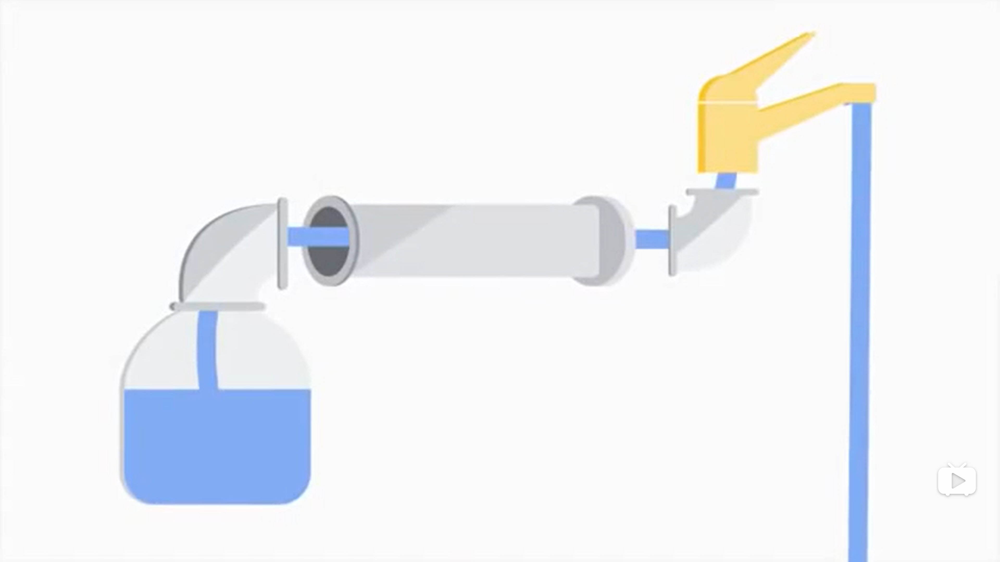
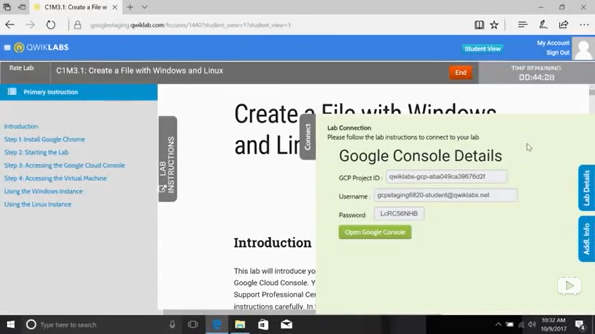

# THE FRAME OF VEDIO:Foundmental of IT#

# Intro to IT#
## Introduction##
**What is IT?**

*Information Technology*:The use of digital technology, like computers and the Internet, to store and process data into useful information

**What does an IT Support Specialist do?**

Managing, Installing, Maintaining, Troubleshooting, Configuring

*Failure as feedback*
## History of Computing##
**From Abacus to Analytical Engine**

one of the earliest known computers was invented in 500BC

Blaise Pascal:perform calculations for user automatically

Joseph Jacqurd:programmable loom, hole and hook

Charles Babbage:analytical engine

Ada Lovelace:developed the first *algorithm* for engine

**The Path to Modern Computers**

*Cryptography*: The art of writing and soving codes

Alan Turing

magenetic tape:1970s and 80s

ENIAC:one of the earliest forms of general-purpose computers

Adimral Grace:the first compiler

Xerox Alto:the first computer that resembled the computers we see nowadays

Steve Jobs

IBM:1980s, personal computer

vedio games...

*Open source*:Anyone could modify and share it
## Digital Logic##
**Computer Language**

*Binary system*:The communication that a computer uses, also known as a base-2 numeral system

**Character Encoding**

*Character encoding*:Assigns our binary values to characters, so that we as humans can read them

**Binary**

*Logic gates*:Allow or transistors to do more complex tasks, like decide where to send electrical signals depending on logical conditions

**How to Count in Binary**

**Abstraction**

*Abstraction*:To take a relatively complex system and simplify for our use
## Computer Architecture Layer##
**Computer Architecture Overview**

*Hardware layer*:Made up of the physical components of a computer

*Operating system*:Allow hardware to communicate with the system

*User*:Interacts with the computer

# Hardware#
## The Modern Computer##
**Intro to Computer Hardware**

*Ports*

*CPU(Cenral Processing Unit)*

*Hard drive*

*Motherboard*

**Programs and Hardware**

*Programs*

*Clock speed*:The maximum number of clock cycles that it can handle in a certain time period
## Components##
**CPU**

Adding, Subtracting, Copying data

Land grid array(LGA)&Pin grid array(PGA)

**RAM**

*DRAM(dynamic random-access memory)*:commonly found in computers:DIMM(dual inline memory module)

*DDR SDRAM*

**Motherboards**

*chipset*:Northbridge&Southbridge

*peripherals*

*expansion slots*:PCI Express(peripheral component interconnext express)

*ATX*&*ITX*

**Storage**

*USB*&*SSD*&*HDD*

*ATA*

**Power Suppliers**

**Peripherals**

*DVI*&*HSMI*&*DispalyPort*
## Starting It Up##
**Module Introduction**
# Operating System#
## what's an operating system?##
**Components of an Operating System**

*Mac OS*&*Linux*&*Windows*&*Chrome OS*

mobile phone operating systems

*I/O management*

**Files and File Systems**

*NTFS*&*ReFS*&*HFS+*&*ext4*

*Block storage*

*Fiel extension*

**Process Management**

*Time slice*

*Kernel*

**Memory Management**

*Virtual memory*

**I/O management**

*I/O devices*

**Interacting with the OS:User Space**

*CLI shell*

**Logs**

**The Boot Process**

*BIOS/UEFI*
## Installing an Operating System##
**Choosing an Operating System**

**Virtual Machines**

**Installing Windows**

**Installing Linux**

**Installing Mac OS X**
# Networking#
## What's networking##
**Basics of Networking

*The Internet*<-->*World Wide Web*

*IP address*

**Networking Hardware**

*WiFi*&*Router*

*Network stack*

**Language of the Internet**

*IP*&*TCP*

**The Web**

*DNS*
## Limitations of the Internet##
**History of the Internet**

*DARPA*

*ARPANET*

*Tim Berners Lee*

**Limitations of the Internet**

*IPV4*&*IPV6*

*NAT*
## Impact of the Internet##
**Impact**

*Globalization*

**Internet of Things**

*IoT*

**Privacy and Security**

# Software#
## Intro to Software##
**What's Software?**

*Coding*

*Programming*

*Programming Languages*

**Types of Software**

*Copyright*
## Interacting with Software##
